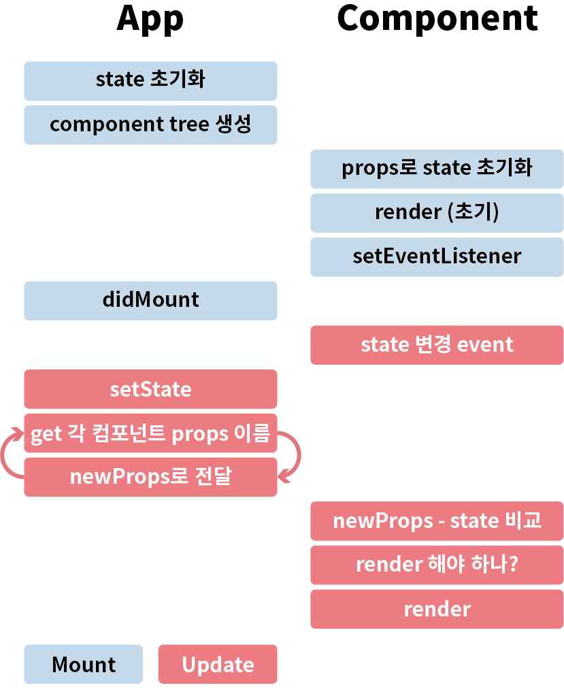

# Deact

## What is it?

자바스크립트로 상태를 관리하고, 상태를 기반으로 클라이언트 사이드 렌더링을 가능하게 하는 짝퉁 리액트

## Why should I make it?

SPA UI 구현을 위해 프레임워크(ex. React)의 도움 없이 바닐라 자바스크립트로 비슷한 동작을 구현해봄으로써 왜 프레임워크를 사용해야 하는지 몸소 체험하기 위해.

## What was considered for this project?

- 각 컴포넌트간의 의존성을 최소화한다. 

- 이를 위해 App(최상위 컴포넌트)에서 상태를 관리하며 나머지 컴포넌트를 관리한다. 

- Re-rendering을 최대한 방지한다. 

- 사용자가 최소한의 학습으로 사용할 수 있어야한다.

## About Deact

### Deact 

각 컴포넌트가 상속 받을 props, 컴포넌트 간의 관계를 저장하고 

컴포넌트의 변경 call을 받아 부모의 상속재산을 받아 현재와 비교한다.

비교 후에 변경 사항이 있다면 자식 컴포넌트에 전달 후 Re-render하도록 하고,

변경 사항이 없다면 기존 DOM을 그대로 사용한다. 

### Component 

컴포넌트와 그 컴포넌트를 관리하는 Deact로 구성되어 있다. 

각 컴포넌트는 이벤트 발생, 새로운 props 전달 받음을 통해 스스로의 상태를 업데이트한다.

업데이트 된 상태를 기반으로 스스로를 render한다. 

## etc

### Re-rendering을 방지해야하는 이유

DOM 자체는 빠르지만 요소가 수백 수천개로 늘어나면 느려질 수 밖에 없다.

결정적 요인으로는 

1. CSS의 재연산
2. 레이아웃 구성
3. 페이지 리페인트

### 예상 흐름 

